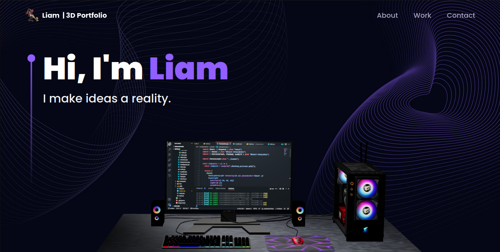

  

  <h1>Liam Reeves' Three.js 3D Portfolio</h1>
  
  

    Three.js 3D Portfolio is a modern UI/UX and functional Developer Portfolio Web built with React & Three.js
  

   
 <h4>
    <a href="https://liams.codes/">Live Link</a>
  </h4>

 
